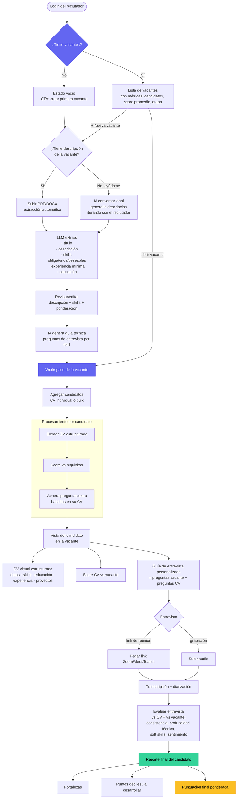
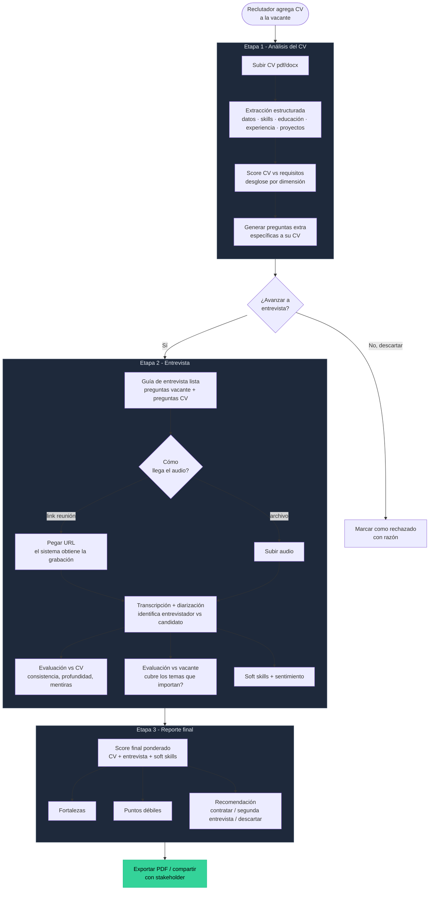
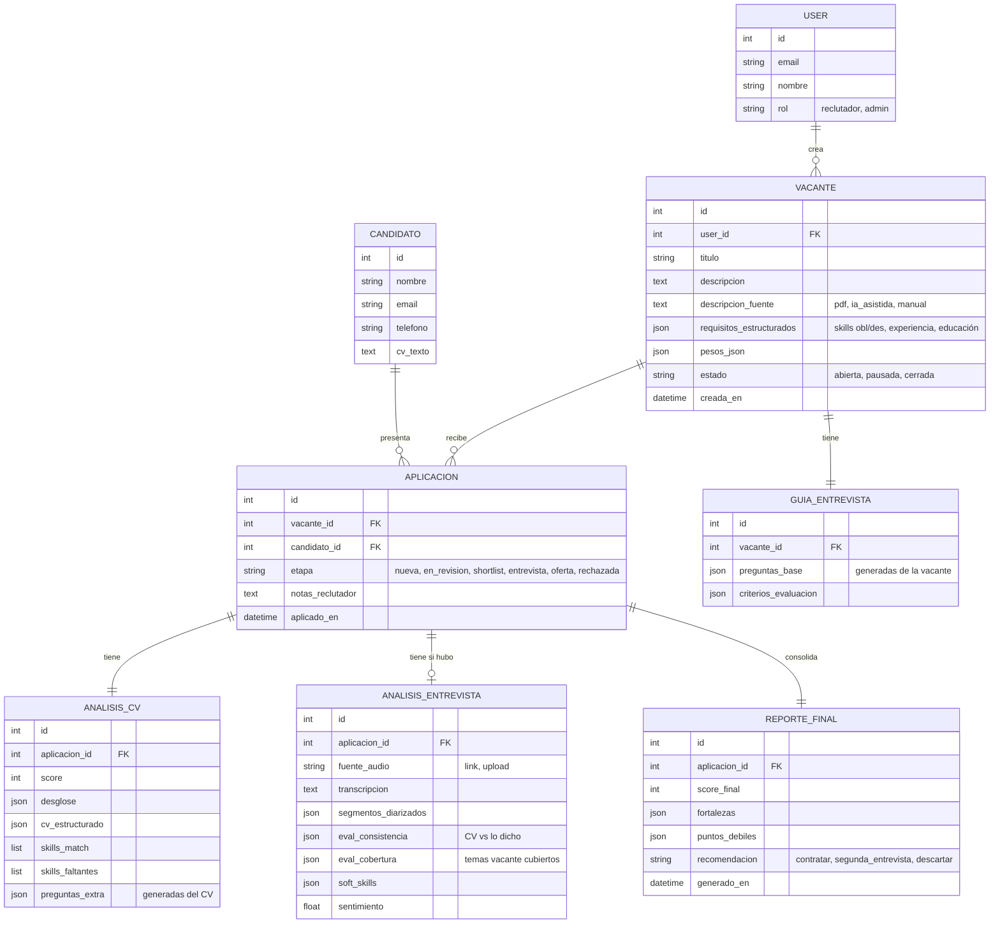
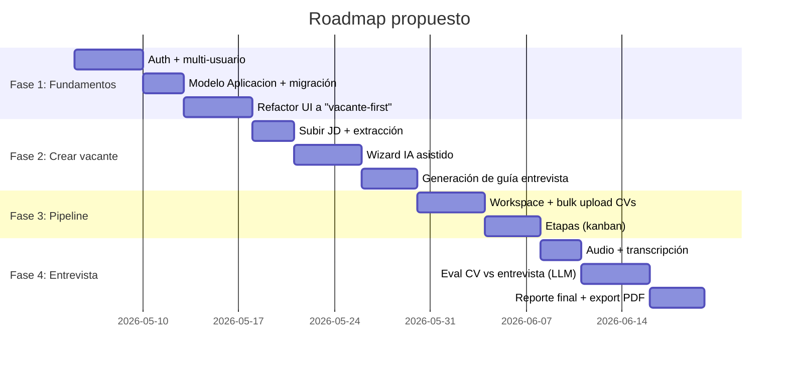

# HireScore — Flujo objetivo (centrado en vacantes)

> Definido con el reclutador. Estado: por implementar.
> El flujo actual del MVP sigue funcionando hasta que se construya esto.

---

## 1. User journey completo

---

## 2. Crear vacante (zoom — paso 3 y 4)

```mermaid
flowchart LR
    Start([+ Nueva vacante]) --> Q{Tienes la<br/>descripción?}

    Q -->|Sí| Path1[Subir archivo<br/>PDF / DOCX / texto pegado]
    Q -->|No| Path2[Modo asistido por IA]

    Path1 --> ExtractDoc[Extraer descripción<br/>+ requisitos del documento]

    Path2 --> Wizard[Wizard conversacional<br/>· puesto<br/>· seniority<br/>· stack/industria<br/>· responsabilidades clave]
    Wizard --> Generate[IA propone JD completa]
    Generate --> Iter{¿Te gusta?}
    Iter -->|No, ajusta| Wizard
    Iter -->|Sí| ExtractDoc

    ExtractDoc --> Structured[Vacante estructurada<br/>· skills obligatorios<br/>· skills deseables<br/>· experiencia<br/>· educación]

    Structured --> Weights[Reclutador ajusta<br/>ponderación por importancia<br/>opcional, hay default]

    Weights --> InterviewGuide[IA genera<br/>guía de entrevista técnica<br/>preguntas + criterios de evaluación]

    InterviewGuide --> Done([Vacante lista<br/>para recibir CVs])

    style Path2 fill:#6366f1,stroke:#4f46e5,color:#fff
    style InterviewGuide fill:#fbbf24,stroke:#f59e0b,color:#000
    style Done fill:#34d399,stroke:#10b981,color:#000
```

---

## 3. Procesamiento de un candidato dentro de una vacante (zoom — pasos 5-8)

---

## 4. Estructura de datos propuesta

**Cambio clave vs hoy:** se introduce `APLICACION` como la tabla pivote. Un candidato puede aplicar a varias vacantes, y cada aplicación tiene su propio análisis CV + análisis entrevista + reporte final.

---

## 5. Mapeo a las pantallas que hay que construir

| # | Pantalla | Reemplaza/extiende |
|---|----------|-------------------|
| 1 | **Login** | nueva — hoy no hay auth |
| 2 | **Dashboard de vacantes** | extiende `Vacantes` actual con métricas por vacante |
| 3 | **Wizard crear vacante** | nueva — hoy es solo un modal con texto plano |
| 3.1 | **Modo IA asistida** | nueva — generación conversacional |
| 4 | **Editor de vacante** (revisar skills + ponderación + guía) | extiende tabs actuales de vacante |
| 5 | **Workspace de vacante** (lista de aplicantes + bulk upload) | nuevo — la vista más usada |
| 6 | **Detalle de aplicación** (CV virtual + score + preguntas + entrevista) | reemplaza vista de Análisis actual |
| 7 | **Pipeline / kanban de etapas** | nuevo — mover candidatos entre etapas |
| 8 | **Reporte final exportable** | nuevo — PDF brandeable |

---

## 6. Recomendaciones — qué seguir, en orden de impacto

### A. Decisiones que conviene cerrar antes de codear

**A1. Etapas del pipeline.** Propongo: `nueva → en_revisión → shortlist → entrevista → oferta → rechazada`. Confirma o ajusta. Define cuáles son terminales.

**A2. Cómo se obtiene el audio del link de reunión.** Zoom, Meet y Teams *no* exponen la grabación por URL públicamente. Opciones realistas:
- Pegar el link → el sistema solo guarda referencia, el reclutador sube el archivo después manualmente (simple, recomiendo empezar aquí).
- Integración OAuth con Zoom Cloud Recording / Meet recordings (requiere apps publicadas en cada marketplace, semanas de trabajo).
- Bot que se une a la reunión y graba (Recall.ai, Read.ai) — más rápido pero costo extra por minuto.

**A3. Identidad del candidato.** ¿Se crea automáticamente extrayendo el nombre del CV? ¿Se deduplica si el mismo candidato aplica a 2 vacantes? Recomiendo: extraer email del CV → si existe el candidato, vincular; si no, crear.

**A4. Alcance de "evaluación de la entrevista".** Hoy haces sentimiento + soft skills básicas. Lo que pediste ("evalúa lo que dice conforme al CV y a la vacante") implica cruce semántico no trivial. Sugerencia mínima viable:
- *Cobertura*: ¿se tocaron los skills obligatorios? (busca menciones)
- *Consistencia*: ¿hay contradicciones entre lo dicho y el CV? (LLM compara)
- *Profundidad*: ¿el candidato dio detalles concretos o respuestas genéricas? (LLM clasifica)

### B. Roadmap sugerido (4 fases, ~6-8 semanas a tu ritmo)

### C. Cosas que vas a querer pero no son MVP

- **Bulk upload con dedupe** por email/nombre — crítico cuando el reclutador tira 30 CVs de un drop.
- **Comparar candidatos lado a lado** (top 3 en una tabla con sus desgloses).
- **Notas y tags por aplicación** — los reclutadores trabajan con anotaciones libres.
- **Compartir reporte vía link público** con expiración (para mandar al cliente sin que tenga cuenta).
- **Export PDF brandeable** (logo del cliente, colores) — diferenciador comercial.
- **Niveles de confianza del LLM** ("este CV no traía email, lo extraje con baja certeza") — vital para que el reclutador sepa cuándo verificar.
- **Consentimiento del candidato** y aviso de procesamiento automático — obligatorio en UE/MX antes de vender.

### D. Cosas que NO recomiendo agregar todavía

- Calendario integrado (programar entrevistas dentro de HireScore) — muerte por scope.
- Comunicación al candidato desde el sistema (emails, status) — alcance enorme, se hace en ATS dedicados.
- ATS completo (career page pública, postulaciones desde candidato) — eres una herramienta de evaluación, no un ATS. Mantente en el nicho.
- Mobile app — los reclutadores trabajan desde laptop.

### E. Mi recomendación de qué hacer ahora mismo

1. **Confirma A1, A2, A3, A4** (15 min de discusión, sin código).
2. **Empieza por el modelo de datos**: agregar `Aplicacion` y migrar. Sin eso, el resto se complica.
3. **Refactoriza la UI a "vacante-first"** sin tocar lógica de negocio. La pantalla actual de Procesar desaparece; subir CVs vive dentro de la vacante.
4. Recién entonces atacar la generación asistida por IA y la evaluación de entrevista, que son las features brillantes pero dependen de los cimientos.

¿Confirmamos A1-A4 y empezamos por el modelo `Aplicacion` + refactor UI?
